# 🛒 CloudCart

<div align="center">

## Full Stack E-Commerce Platform

A modern, secure, and scalable full-stack e-commerce application built with **React**, **Spring Boot**, **PostgreSQL**, **Docker**, **JWT Authentication**, and **Stripe Payments**.


</div>

---

# 📖 Table of Contents

- Project Overview
- Features
- Technology Stack
- Architecture
- Application Screenshots
- Project Structure
- Security
- Payment Integration
- Email Notifications
- REST APIs
- Getting Started
- Docker Deployment
- AWS Deployment
- Future Enhancements
- Author
- License

---

# 📌 Project Overview

CloudCart is a full-stack e-commerce web application designed to provide a secure and modern online shopping experience.

The application allows customers to browse products, manage shopping carts, securely complete payments using Stripe Checkout, write product reviews, manage wishlists, and view order history.

Administrators can manage products, monitor customer orders, and maintain the product catalog through an admin dashboard.

The project follows a modern client-server architecture using React on the frontend and Spring Boot REST APIs on the backend with PostgreSQL as the database.

---

# ✨ Features

## 👤 Customer Features

- User Registration
- Secure Login
- JWT Authentication
- Forgot Password
- Reset Password
- Browse Products
- Product Search
- Product Details
- Product Reviews
- Wishlist
- Shopping Cart
- Stripe Checkout
- Secure Online Payments
- Order History
- Responsive User Interface

---

## 👨‍💼 Admin Features

- Admin Dashboard
- Add Products
- Edit Products
- Delete Products
- Manage Orders
- Role-Based Authorization

---

# 🛠 Technology Stack

## Frontend

- React.js
- React Router
- Axios
- CSS

## Backend

- Spring Boot
- Spring Security
- JWT Authentication
- Spring Data JPA

## Database

- PostgreSQL

## Payment Gateway

- Stripe Checkout

## Email Service

- JavaMail

## DevOps

- Docker
- Docker Compose

## Tools

- Git
- GitHub
- VS Code
- pgAdmin

---

# 🏗 System Architecture

```
                    Users
                       │
                       ▼
               React Frontend
                       │
              REST API Requests
                       │
                       ▼
              Spring Boot Backend
                       │
        ┌──────────────┼──────────────┐
        ▼              ▼              ▼
 Spring Security   PostgreSQL     Stripe API
      JWT                           Payments
```

---

# 📸 Application Screenshots

## 🏠 Home

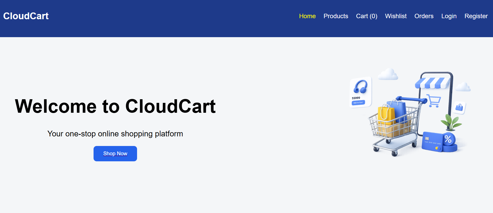

---

## 🔐 Login

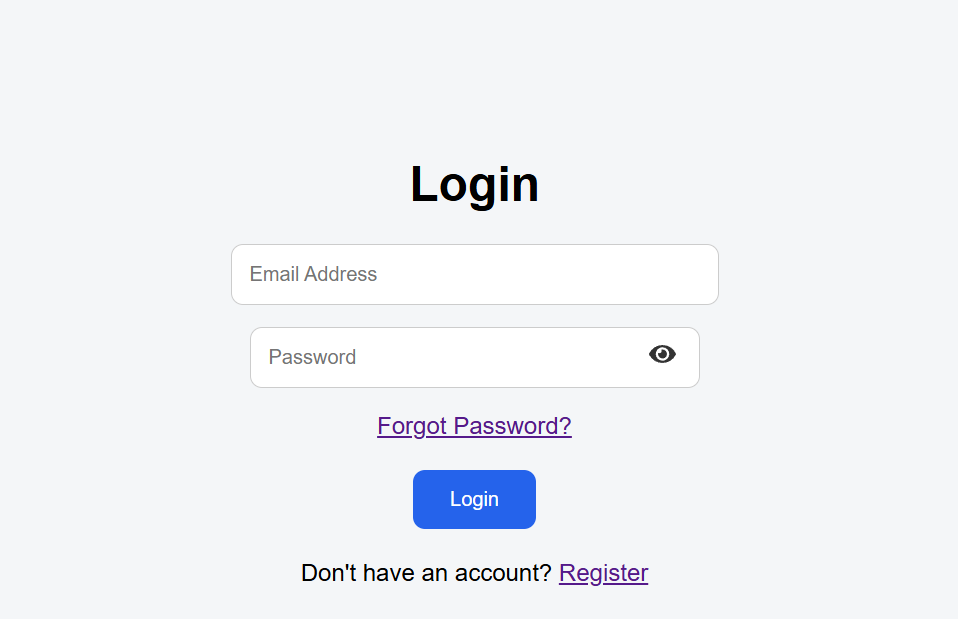

---

## 📝 Register

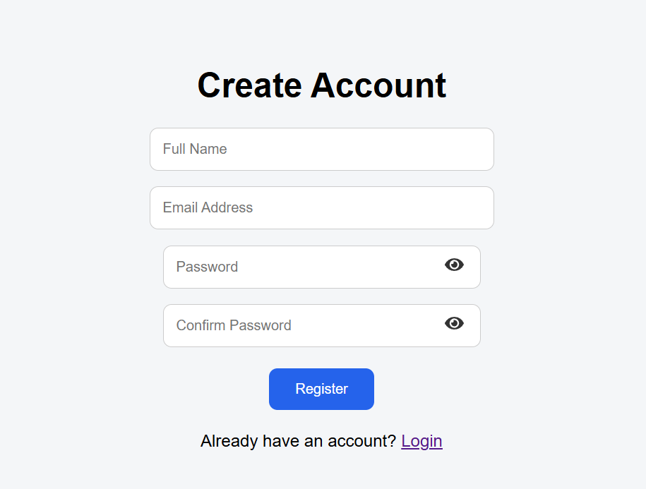

---

## 📦 Products

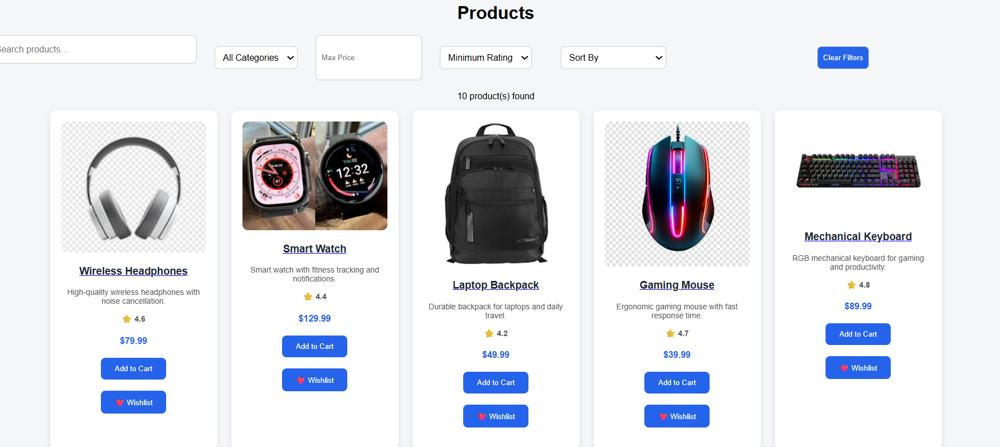

---

## 📄 Product Details


---

## ⭐ Reviews

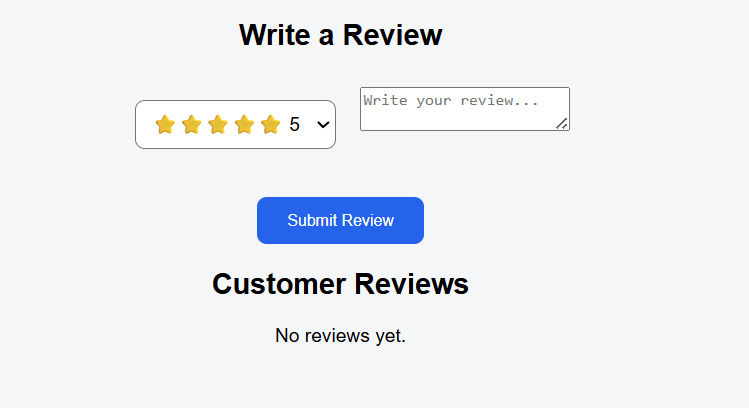

---

## ❤️ Wishlist

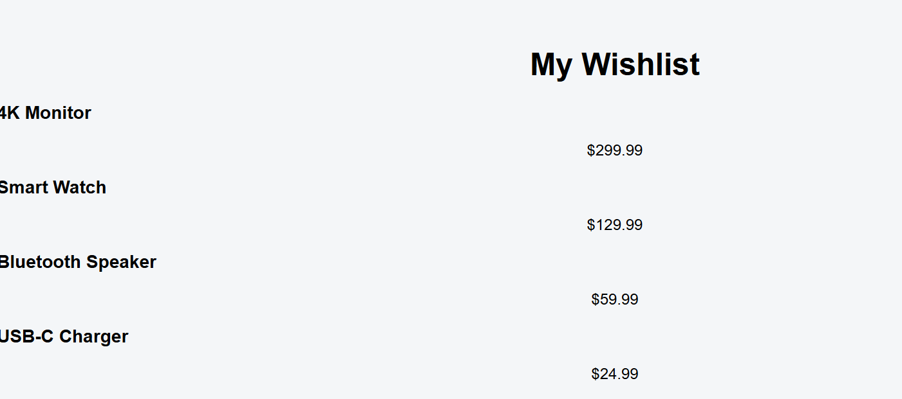

---

## 🛒 Shopping Cart

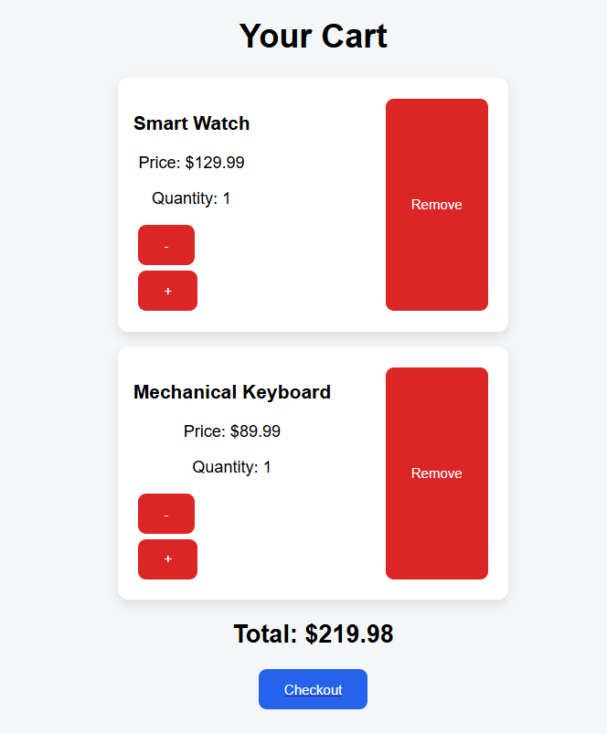

---

## 💳 Checkout

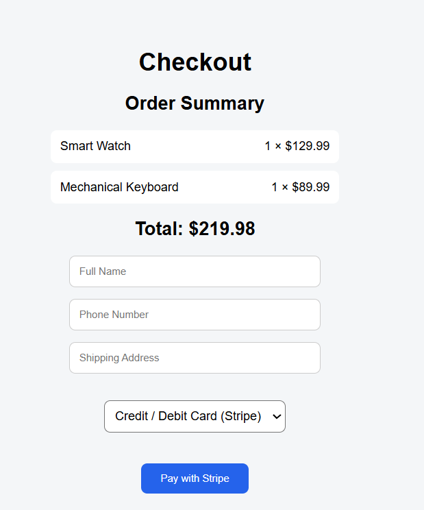

---

## 💰 Stripe Checkout

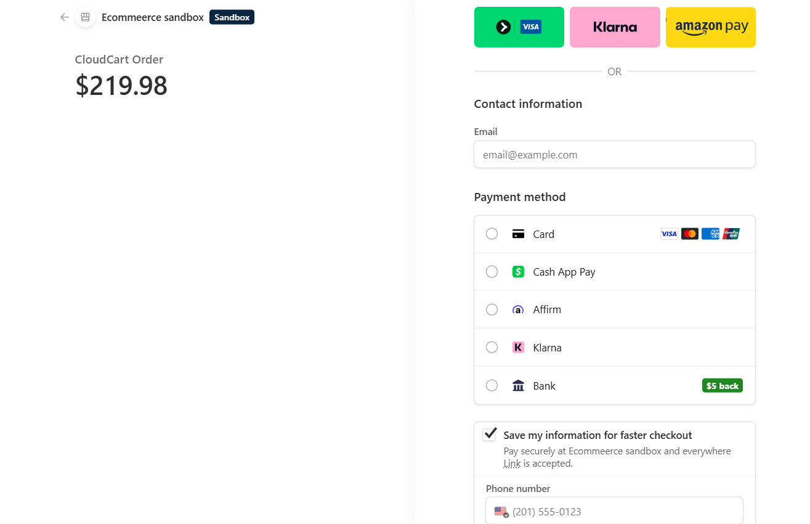

---

## ✅ Payment Success

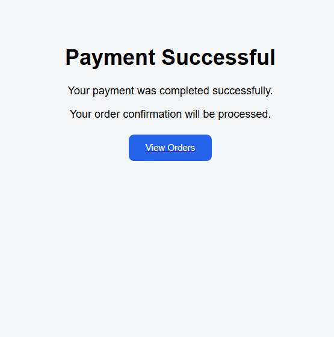

---

## 📦 Orders

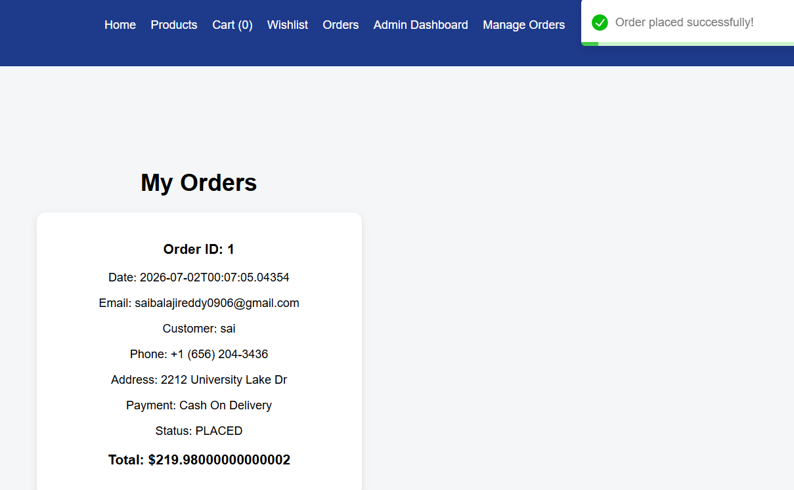

---

## 👨‍💼 Admin Dashboard

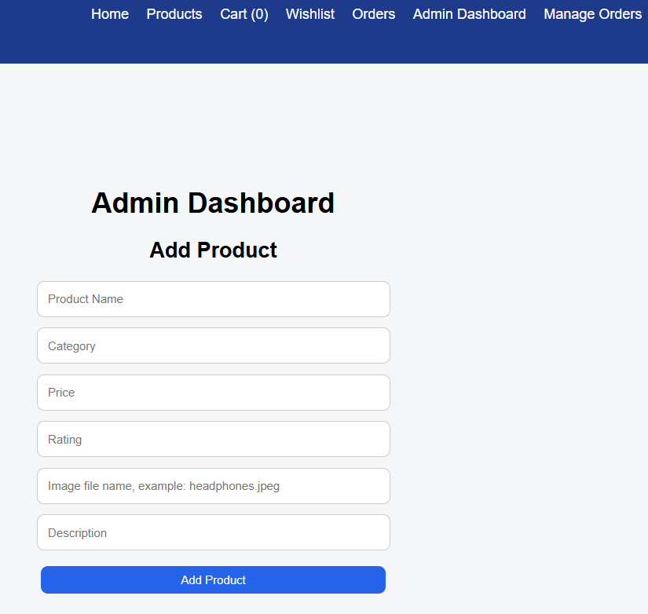

---

## ➕ Add Product

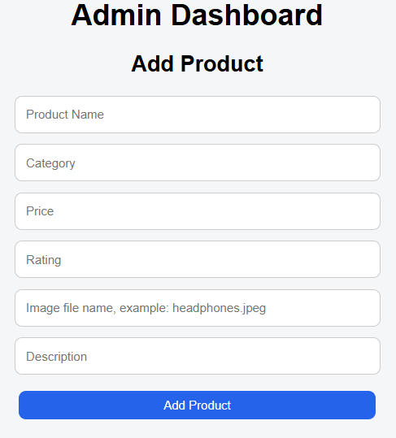

---

## ✏ Edit Product

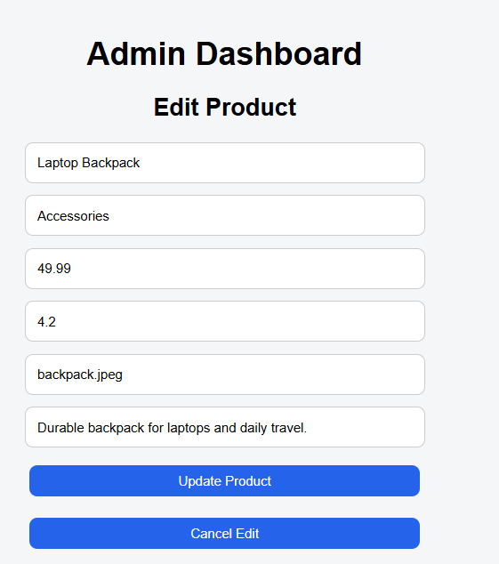

---

# 📂 Project Structure

```
CloudCart
│
├── cloudcart-backend
│     ├── config
│     ├── controller
│     ├── dto
│     ├── entity
│     ├── repository
│     ├── security
│     ├── service
│     └── resources
│
├── cloudcart-frontend
│     ├── src
│     ├── assets
│     ├── components
│     ├── context
│     ├── pages
│     └── services
│
├── README-images
├── docker-compose.yml
└── README.md
```

---

# 🔐 Security

CloudCart implements enterprise-level security features.

- JWT Authentication
- BCrypt Password Encryption
- Spring Security
- Role-Based Access Control
- Protected REST APIs
- Secure Stripe Integration

---

# 💳 Stripe Payment Integration

Integrated with Stripe Checkout.

Supports

- Credit Cards
- Debit Cards
- Secure Online Payments

---

# 📧 Email Notifications

CloudCart uses JavaMail for

- Password Reset Emails
- Account Notifications

---

# 🔌 REST API Endpoints

## Authentication

```
POST /api/auth/register

POST /api/auth/login

POST /api/auth/forgot-password

POST /api/auth/reset-password
```

---

## Products

```
GET /api/products

GET /api/products/{id}

POST /api/products

PUT /api/products/{id}

DELETE /api/products/{id}
```

---

## Orders

```
POST /api/orders

GET /api/orders
```

---

## Payments

```
POST /api/payments/create-checkout-session
```

---

## Reviews

```
GET /api/reviews/product/{id}

POST /api/reviews
```

---

# 🚀 Getting Started

## Clone Repository

```bash
git clone https://github.com/saibalaji6/CloudCart.git
```

---

## Backend

```bash
cd cloudcart-backend
```

---

## Frontend

```bash
cd cloudcart-frontend
```

---

## Run using Docker

```bash
docker compose up --build
```

---

Open

```
http://localhost:3000
```

---

# 🐳 Docker

The application is fully containerized.

```
React
↓

Spring Boot

↓

PostgreSQL

↓

Docker Compose
```

Start

```bash
docker compose up --build
```

Stop

```bash
docker compose down
```

---

## ☁️ AWS Deployment

CloudCart was successfully deployed and tested on AWS EC2 using Docker and Docker Compose.

Deployment included:

- Amazon EC2
- Docker
- Docker Compose
- Spring Boot
- React
- PostgreSQL
- Stripe Checkout

### EC2 Instance

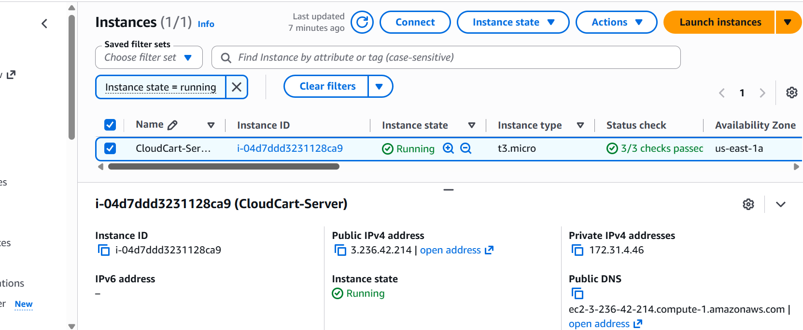

### Docker Containers Running on EC2

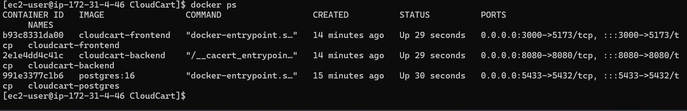

### Stripe Checkout on AWS

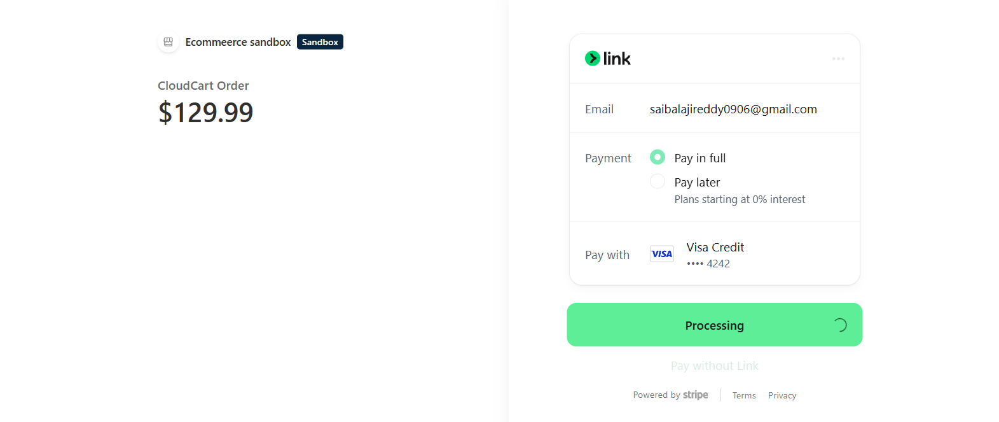

# 📈 Future Enhancements

- AI Product Recommendations
- Inventory Management
- Coupons & Discounts
- Order Tracking
- Admin Analytics Dashboard
- Redis Cache
- GitHub Actions CI/CD
- Kubernetes Deployment
- AWS ECS Deployment
- Prometheus & Grafana Monitoring

---

# 👨‍💻 Author

**Sai Balaji Reddy Karumuri**

GitHub

https://github.com/saibalaji6

LinkedIn

http://www.linkedin.com/in/karumuri-sai-balaji-reddy/

---

# 🤝 Contributing

Contributions are welcome.

Please fork the repository and submit a Pull Request.

---

# ⭐ Support

If you found this project useful,

⭐ Please consider giving it a Star.

---

# 📄 License

This project is licensed under the MIT License.
